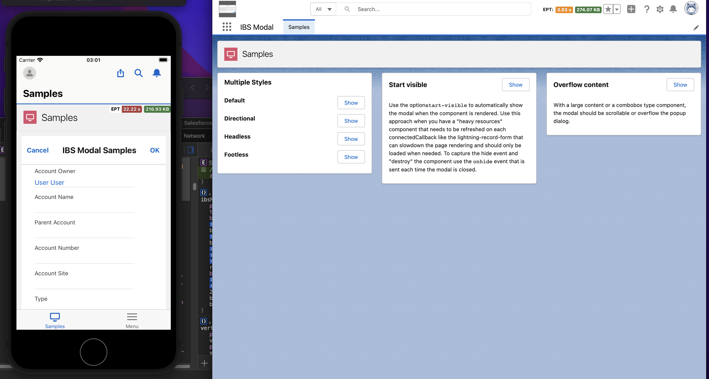
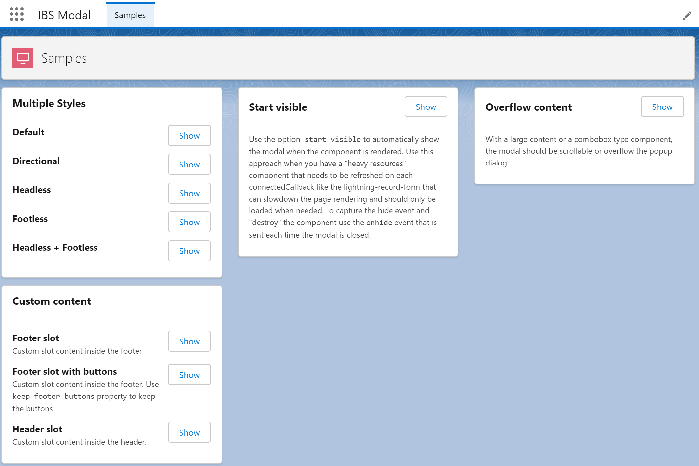

# LWC Modal (Alpha Release)

## About

Generic and fully customizable LWC Modal component (LWC). Developed because Salesforce doesn't provide a proper modal component that can be compatible with mobile and desktop.

## Features
- Native SLDS Style: https://www.lightningdesignsystem.com/components/modals/
- Support all the SLDS variants: headless, footless, sizes and directional
- Mobile support
- Dynamic action buttons
- Fully customizable with slots
- Multi-language support (EN, DE, FR, PT)
- Integrated on a single component (easy to copy to multiple projects)
- Well documented

## Instructions

### Use on your project
Everything was developed in a single LWC, so you just need a new single component on your project. If you want to use the multi-language support you will have to make sure that the scratch org supports the language Settings required for translations and copy the custom labels.

- Copy the following files to your project:
    - force-app/main/default/lwc/lwcModal/**
- Merge the custom labels with the labels of your project
    - force-app/main/default/translations/*.xml
    - force-app/main/default/labels/CustomLabels.labels-meta.xml

### Testing and learn how to use it

- Run the `createorg.sh` to create a scratch org
- Open the `LWC Modal` lightning app
- Explore the code on the `samples` component
- Edit the page to preview on mobile devices or login with your mobile device (check the `password.env` file)

## Reference (TODO)

### Attributes
| Name | Type | Required | Default | Description |
|-|-|-|-|-|
| object-api-name | *string* | **true** |  | The source object Api Name eg. Account |

### Methods (TODO)
| NAME | ARGUMENTS | DESCRIPTION |
|-|-|-|
| refresh |  | refresh the table reloading the data completely |

### Custom Events (TODO)
The event is fired when user clicks on the quick action button

| NAME | TYPE| DESCRIPTION |
|-|-|-|
| detail | *object* | the row data |

The event properties are as follows.

| PROPERTY | VALUE | DESCRIPTION |
|-|-|-|
| bubbles | true |  |
| cancelable | true |  |
| composed | true |  |

https://www.lightningdesignsystem.com/components/modals/

https://github.com/trailheadapps/lwc-recipes/blob/main/force-app/main/default/lwc/modal/modal.html

https://github.com/jamessimone/lwc-modal/blob/main/force-app/main/default/lwc/modal/modal.html

https://github.com/salesforce-ux/design-system/blob/138ea73a0414b436837a97fd75b3f9777b91ca12/ui/components/modals/base/_index.scss

### test webp lossless
